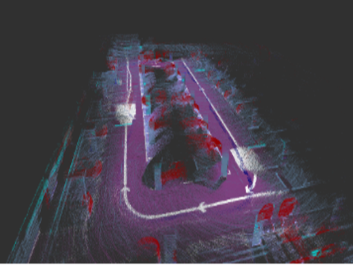
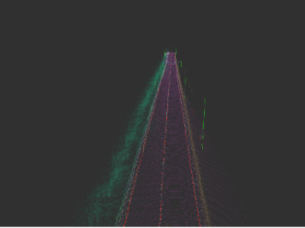
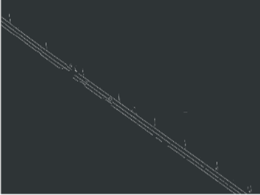
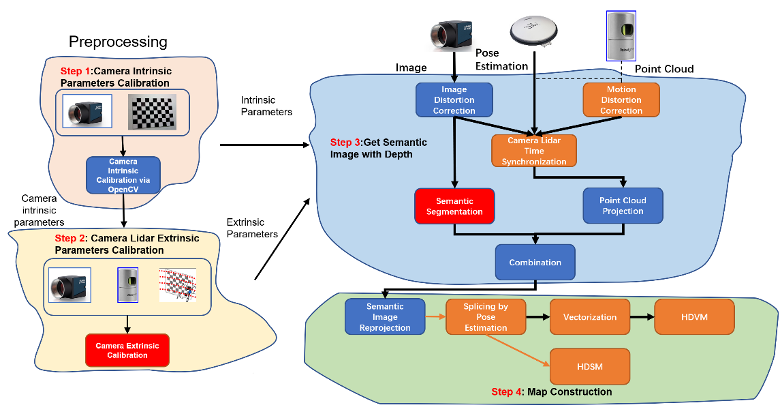

# IPNL - HDMap Builder
## Introduction
This is a tool for HDMap construction developed by IPNL. It's a whole pipeline, which can build a HD semantic map or HD vector map. A docker version will coming soon.

<table style="width:100%; border:none;text-align:center" cellspacing="0" cellpadding="0" border="0" align="center">
<tr>
  <td></td><td></td>
</tr>
<tr>
  <td><strong>The progress of indoor map construction</strong></td><td><strong>The 3D semantic map of the indoor scenario</strong></td>
</tr>
<tr>
  <td></td><td></td>
</tr>
<tr>
  <td><strong>The 3D semantic map of the outdoor scenario</strong></td><td><strong>The 3D vector map of the outdoor scenario</strong></td>
</tr>
</table>

## Oveview
* [Features](#key-features)
* [Pipeline](#pipeline-overview)
* [Requirements](#requirements)
* [Preprocess](#preprocess)
* [Usage](#usage)
    * [Folder Structure](#folder-structure)
    * [Bag File Structure](#bag-file-structure)

## Key Features
Our tool supports below features:
* **Soft time synchronization**
* **Image undistortion**
* **LiDAR motion distortion correction**
* **Image semantic segmentation**
* **Lane lines and poles vectorization**
* **...**

For more details, please refer to our [paper](blank)

## Pipeline Overview

<p align="center">
    
</p>

## Requirements
This tool needs lots of dependencies, thus, we urge all of you to use docker to run our map builder.
### **Docker Install**
0. Check that your grphics driver and docker are properly installed, especially the nvidia-docker suit.
1. Clone our git repository to local disk.
   ```bash
   git clone https://github.com/ebhrz/HDMap.git
   ```
2. Open the docker folder and start the docker via the start script.
   ```bash
   cd HDMap && cd docker
   sudo ./start.sh
   ```
   You can run this script repeatedly to open several command windows to run roscore, rviz and the map builder.
3. Use the stop script to stop the docker.
   ```bash
   sudo ./stop.sh
   ```
4. (optional) You can build the docker image by yourself by the build script:
   ```bash
   sudo ./build.sh
   ```
### **Manually Install**
*   ***ROS***
<br>Our tool utilizes ROS to store the recording data and do the visualization. ROS installation refers to [here](http://wiki.ros.org/noetic/Installation)
      - ***Novatel Msgs***
        <br>Map construction requires accurate localization. In our sensorkit, a span-CPT is employed to be the ground truth. Please install its message type via 
        ```bash
            sudo apt install ros-(your ROS version)-novatel-gps-msgs
        ```
* ***Pandas*** and ***Numpy***
<br>Please use the commands below to install:
```bash
pip install numpy
pip install pandas
```
* ***OpenCV***
<br>Our tool also requires OpenCV. Install it via:
```bash
pip install opencv-python
```
* ***PyTorch***
<br>Please refer to PyTorch installation guide at [here](https://pytorch.org/get-started/locally/)
    * ***Detectron2***
    <br>This is a image segmentation framework from Facebook using PyTorch. Our tool directly uses the pretrained Swin2Transformer model. Please refer to its installation guide at [here](https://detectron2.readthedocs.io/en/latest/tutorials/install.html)
    * ***MMSegmentation***
    <br>This is a image segmentation framework by OpenMMLab using PyTorch. Our tool can also support the pretrained model in their model zoo. Please refer to its installation guide at [here](https://mmsegmentation.readthedocs.io/en/latest/get_started.html)
* ***Scikit-learn***
<br>This is a powerful tool for machine learning. Our tool uses DBSCAN from it to do the cluster. Install it via:
```bash
pip install scikit-learn
```
* ***Pclpy***
<br>Since we'll process the point cloud, we choose this python wrapper for PCL which uses pybind11 to maintain the same API. Installation refers to [here](https://github.com/davidcaron/pclpy)

## Folder Structure
```
.
├── LICENSE
├── README.md
├── config
│   ├── ade20k.json
│   ├── indoor_config.json
│   ├── outdoor_config.json
│   └── outdoor_distortion_config.json
├── data
│   ├── indoor
│   │   ├── indoor.bag  # place your indoor bag file here
│   │   └── pose6d.csv  # the prior made pose estimation result
│   └── outdoor
│       └── outdoor.bag # place your outdoor bag file here
├── result # this folder will be gererated automatically
├── imseg
│   ├── mask2former
│   │   ├── class.json
│   │   ├── config
│   │   ├── config.py
│   │   ├── model
│   │   │    └── model.pkl # place the pretrainied swin2transformer model 
│   │   └── mask2former
│   └── mmseg
│       ├── _base_
│       ├── configs
│       └── model
│            └── model.pth # place the pretrainied mmsegmentation model 
├── indoor.py
├── outdoor.py
├── make_vector.py
├── make_pcl.py
├── predict.py
├── util.py
└── vis.rviz
```
If you want to run an example, please click the link to download the data.
* [indoor.bag](https://www.dropbox.com/s/5cydkewq6ey3k10/2023-01-31%20-%20Indoor.bag?dl=0)
* [outdoor.bag](https://www.dropbox.com/s/k3g6966kaz0qu7e/2023-01-31%20-%20Outdoor.bag?dl=0)
* [model.pkl](https://dl.fbaipublicfiles.com/maskformer/mask2former/mapillary_vistas/semantic/maskformer2_swin_large_IN21k_384_bs16_300k/model_final_90ee2d.pkl)
## Bag File Structure
For the outdoor bag file, here's an example:
```
path:        outdoor.bag
version:     2.0
duration:    34:38s (2078s)
start:       Dec 23 2021 11:43:52.57 (1640231032.57)
end:         Dec 23 2021 12:18:31.01 (1640233111.01)
size:        64.5 GB
messages:    327941
compression: none [41569/41569 chunks]
types:       novatel_msgs/INSPVAX        [b5d66747957184042a6cca9b7368742f]
             sensor_msgs/CompressedImage [8f7a12909da2c9d3332d540a0977563f]
             sensor_msgs/PointCloud2     [1158d486dd51d683ce2f1be655c3c181]
topics:      /acc_pose             207936 msgs    : novatel_msgs/INSPVAX          
             /image                 57732 msgs    : sensor_msgs/CompressedImage
             /origin_cloud          41515 msgs    : sensor_msgs/PointCloud2
```
And for the indoor bag file, here's an example:
```
path:        garage.bag
version:     2.0
duration:    6:59s (419s)
start:       Feb 04 2022 18:04:18.39 (1643969058.39)
end:         Feb 04 2022 18:11:18.08 (1643969478.08)
size:        70.1 GB
messages:    342273
compression: none [29148/29148 chunks]
types:       sensor_msgs/Image           [060021388200f6f0f447d0fcd9c64743]
             sensor_msgs/PointCloud2     [1158d486dd51d683ce2f1be655c3c181]
topics:      /velodyne_points                   4193 msgs    : sensor_msgs/PointCloud2        
             /zed2/camera/left/image_raw       12477 msgs    : sensor_msgs/Image          
```
Ros topic will be configured in config file.
~~So far, we should configure the ros topics in [outdoor.py]() and [indoor.py]() manually, but as the config file is supported, it can be defined in the config file.~~
## Preprocess
Please make your own config file refer to the config files in config folder. Here are two example config files for indoor and outdoor. The explanations of each field are below the config files.
> outdoor config file
```json
{
    "bag_file":"data/outdoor/outdoor.bag",
    "start_time":120,
    "play_time":5,
    "GNSS_topic":"/acc_pose",
    "LiDAR_topic":"/dedistortion_cloud",
    "cloud_distortion":false,
    "camera_topic":"/zed2/camera/left/image_raw/compressed",
    "image_compressed":true,
    "extrinsic":    
    [
        [ 1.0102, -0.0026, -0.0087,  0.1135],
        [-0.0033, -0.0030, -0.9963, -0.1617],
        [ 0.0049,  0.9962, -0.0287,  0.0516],
        [ 0.0000,  0.0000,  0.0000,  1.0000]
    ],
   "intrinsic":
    [
        [543.5046, 0, 630.7183], 
        [0, 540.5383, 350.9063], 
        [0, 0, 1]
    ],
    "distortion_matrix":[-1.05873889e-01,  1.32265629e-01, -8.55667814e-05,-1.04098281e-03, -7.01241428e-02],
    "save_folder":"result/outdoor",
    "mode":"outdoor",
    "model_config":"imseg/mask2former/config/swin/maskformer2_swin_large_IN21k_384_bs16_300k.yaml",
    "model_file":"imseg/mask2former/model/model.pkl",
    "lane_class":24,
    "pole_class":45,
    "vector":true,
    "predict_func":"get_predict_func",
    "cmap":"mapillary"
}
```
> indoor config file
```json
{
    "bag_file":"data/indoor/indoor.bag",
    "pose_file":"data/indoor/pose6d.csv",
    "start_time":0,
    "play_time":-1,
    "LiDAR_topic":"/velodyne_points",
    "camera_topic":"/zed2/zed_node/left/image_rect_color/compressed",
    "image_compressed":true,
    "extrinsic":    
    [
        [ 1.0102, -0.0026, -0.0087,  0.1135],
        [-0.0033, -0.0030, -0.9963, -0.1617],
        [ 0.0049,  0.9962, -0.0287,  0.0516],
        [ 0.0000,  0.0000,  0.0000,  1.0000]
    ],
   "intrinsic":
    [
        [543.5046, 0, 630.7183], 
        [0, 540.5383, 350.9063], 
        [0, 0, 1]
    ],
    "distortion_matrix":[-1.05873889e-01,  1.32265629e-01, -8.55667814e-05,-1.04098281e-03, -7.01241428e-02],
    "save_folder":"result/indoor",
    "mode":"indoor",
    "model_config":"imseg/mmseg/configs/swin/upernet_swin_large_patch4_window12_512x512_pretrain_384x384_22K_160k_ade20k.py",
    "model_file":"imseg/mmseg/model/upernet_swin_large_patch4_window12_512x512_pretrain_384x384_22K_160k_ade20k_20220318_091743-9ba68901.pth",
    "lane_class":24,
    "pole_class":45,
    "predict_func":"get_predict_func_mmsegmentation",
    "cmap":"ade20k"
}
```
* bag_file
  <br> The path of the bag file
* pose_file
  <br> The path of the pose file, format is (x,y,z,order,q,w,e,r,where q,w,e,r are the quaternion)***(indoor only, outdoor ignored)***
* start_time
  <br> From where to read the bag, or skip how long of the bag
* play_time
  <br> How long to play the bag, -1 for the whole bag
* GNSS_topic
  <br> The GNSS topic name in Ros bag, ***(outdoor only, indoor ignored)***
* LiDAR_topic
  <br> The LiDAR topic name in Ros bag
* cloud_distortion
  <br> To do the LiDAR motion distortion fix or not
* camera_topic
  <br> The camera topic name in Ros bag
* image_compressed
  <br> Whether the image format in the Ros bag is compressed or not
* extrinsic
  <br> LiDAR and camera extrinsic matrix
* intrinsic
  <br> Camera intrinsic matrix
* distortion_matrix
  <br> Camera distortion matrix
* save_folder
  <br> Save folder name
* mode
  <br> Use indoor mode or outdoor mode
* model_config
  <br> The path of the segmentation model config file
* model_file
  <br> The path of the segmentation model file
* lane_class
  <br> The ordinal number of the lane line in the segmentation model 
* pole_class
  <br> The ordinal number of the pole in the segmentation model 
* vector
  <br> Whether to generate the vectormap. Used by make_vector.py. 
* predict_func
  <br> This is the function name of the prediction function in file ***predict.py***. There are already two function ***get_predict_func_detectron*** and ***get_predict_func_mmlab***. One is for the pretrained models from Facebook and the other is for the models from MMLab. If you want to use your own models, please write your own prediction function, which is required to return a numpy array with the shape of W\*H. The value of each pixel is the segmentation class. For example an image with the size 3*3 and 3 types after the segmentation:
  <br>
  ```
  [
    [1,1,2],
    [1,2,1],
    [0,1,2]
  ]
  ```
* cmap
  <br> The color map scheme, ***ade20k***, ***cityscapes*** and ***mapillary*** are available.

### Indoor Pose Estimation
For indoor scenario, there is no GNSS signal to provide global localization. Thus, pose estimation should be performed at first. Also, We recommond you to use LiDAR SLAM algorithm such as A-LOAM, LIO-SAM, etc. to estimate the pose. [Here](TODO) is an implementation of LIO-SAM with several changes to generate the pose for all the LiDAR messages.
## Usage
* `outdoor.py`
```
  -h, --help                                    show this help message and exit
  -c CONFIG, --config CONFIG                    The config file path, recommand use this method to start the tool
  -b BAG, --bag BAG                             The recorded ros bag file
  -f FASTFOWARD, --fastfoward FASTFOWARD        Start to play at the nth seconds
  -d DURATION, --duration DURATION              Time to play
  -u UNDISTORTION, --undistortion UNDISTORTION  Do LiDAR points undistortion
```
* `indoor.py`
```
  -h, --help                                    show this help message and exit
  -c CONFIG, --config CONFIG                    The config file path, recommand use this method to start the tool
  -b BAG, --bag BAG                             The recorded ros bag
  -f FASTFOWARD, --fastfoward FASTFOWARD        Start to play at the nth seconds
  -d DURATION, --duration DURATION              Time to play
  -p POSE, --pose POSE                          Pose file for the construction
```
* `make_pcl.py`
```
  -h, --help                                    show this help message and exit
  -c CONFIG, --config CONFIG                    The config file path, recommand use this method to start the tool
  -i INPUT, --input INPUT
  -m {indoor,outdoor}, --mode {indoor,outdoor}  Depend on the way to store the pickle file
  -f FILTERS [FILTERS ...], --filters FILTERS [FILTERS ...] Default to show all the classes, the meaning of each class refers to class.json
  -s SAVE, --save SAVE                          Save to pcd file
  -t TRAJECTORY, --trajectory TRAJECTORY        Trajectory file, use to follow the camera
  --semantic SEMANTIC                           Semantic photos folder
  --origin ORIGIN                               Origin photos folder
```
* `make_vector.py`
```
  -h, --help                                    show this help message and exit
  -c CONFIG, --config CONFIG                    The config file path, recommand use this method to start the tool
  -i INPUT, --input INPUT
  -m {outdoor,indoor}, --mode {outdoor,indoor}  Depend on the way to store the pickle file
  -f FILTERS [FILTERS ...], --filters FILTERS [FILTERS ...] Default to show all the classes, the meaning of each class refers to class.json
  -s SAVE, --save SAVE                          Save to pcd file
  -t TRAJECTORY, --trajectory TRAJECTORY        Trajectory file, use to follow the camera
  --semantic SEMANTIC                           Semantic photos folder
  --origin ORIGIN                               Origin photos folder
  --vector                                      Do the vectorization, only available when filters are accepted
```
### Example
To run the map builder, please first start the ros core
```
$ roscore
```
And you can open the rviz to see the visualization
```
rviz -d vis.rviz
```
#### Indoor Example
1. First synchronize and segment.
```bash
python3 indoor.py -c config/indoor_config.json
```


1. Make the global 3D semantic map. 
```
python3 make_pcl.py -c config/indoor_config.json
```

3. Make the global 3D vector map.
```
python3 vector.py -c config/indoor_config.json
```

#### Outdoor Example
1. First synchronize and segment.
```bash
python3 outdoor.py -c config/outdoor_config.json
```
2. Make the global 3D semantic map. 
```
python3 make_pcl.py -c config/outdoor_config.json
```
3. Make the global 3D vector map.
```
python3 vector.py -c config/vector_config.json
```
-----

## Example Sensor Kit Setup
We use part of the sensor kit in **[UrbanNavDataset](https://github.com/IPNL-POLYU/UrbanNavDataset/blob/master/README.md)**, they are:
  - 3D LiDAR sensor: ([HDL 32E Velodyne](https://velodynelidar.com/products/hdl-32e/)): (360 HFOV, +10~-30 VFOV, 80m range, 10Hz)，
  - Camera: [ZED2](https://www.stereolabs.com/zed-2/) Stereo (30 Hz)
  - [SPAN-CPT](https://www.novatel.com/products/span-gnss-inertial-systems/span-combined-systems/span-cpt/): (RTK GNSS/INS, RMSE: 5cm, 100Hz)

In outdoor scenario, all the three sensors are used. And in indoor scenario, GNSS is not available, thus only LiDAR and camera are used. For the detail of the sensor kit, please refer to our **[UrbanNavDataset](https://github.com/IPNL-POLYU/UrbanNavDataset/blob/master/README.md)**
<p align="center">
  
</p>
<p align="center">
  
</p>
